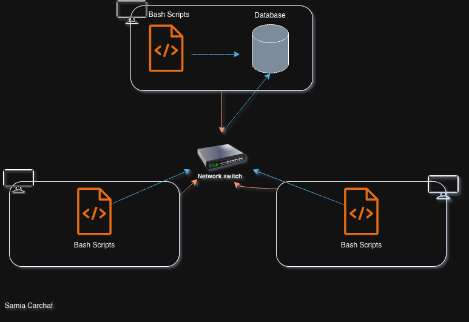

# Linux Cluster Monitoring Agent

## Introduction

The Linux Cluster Monitoring Agent is a resource monitoring tool designed to track hardware specifications and real-time resource usage across a Linux Cluster.
The system is designed for the Jarvis Linux Cluster Administration (LCA) team, who manages a cluster of 10 Rocky Linux nodes, who uses this tool to collect data from each server and store it in a PostgreSQL database for analysis and resource planning.  
The project leverages Bash scripting for data collection, Docker for database portability, PostgreSQL for structured storage, Git for version control, crontab for automated scheduling, and GCP as the underlying cloud infrastructure.

## Quick Start

**1. Start a PostgreSQL instance using psql_docker.sh**
```bash
./scripts/psql_docker.sh create <db_username> <db_password>
```

**2. Create the database tables using ddl.sql**
```bash
psql -h localhost -U <db_username> -d host_agent -f sql/ddl.sql
```

**3. Collect and insert hardware specs for the current host**
```bash
./scripts/host_info.sh localhost 5432 host_agent <db_username> <db_password>
```

**4. Collect and insert resource usage data**
```bash
./scripts/host_usage.sh localhost 5432 host_agent <db_username> <db_password>
```

**5. Automate usage collection with crontab (every minute)**
```bash
crontab -e
* * * * * bash /home/<your_user>/linux_sql/scripts/host_usage.sh localhost 5432 host_agent <db_username> <db_password> > /tmp/host_usage.log 2>&1
```

## Implementation

### Architecture

The cluster consists of multiple Linux nodes, each running the monitoring agent scripts. A single node hosts the PostgreSQL database inside a Docker container and serves as the data collection hub. Each agent communicates with this central database over the network.

<p align="center">
  
</p>

### Scripts

---

#### `psql_docker.sh`

* Manages the lifecycle of the PostgreSQL Docker container (`jrvs-psql`). 
* Supports `create`, `start`, and `stop` commands. 
* On `create`, it initializes a named Docker volume (`pgdata`) for data persistence and spins up a PostgreSQL 9.6 Alpine instance.

```bash
# Create the container (first time only)
./scripts/psql_docker.sh create <db_username> <db_password>
 
# Stop the container
./scripts/psql_docker.sh stop
 
# Start the container after a reboot
./scripts/psql_docker.sh start
```

---

#### `host_info.sh`
 
Collects static hardware specifications from the current host using `lscpu` and `/proc` filesystem reads. This script is intended to run **once per node** during initial setup.
 
```bash
./scripts/host_info.sh <psql_host> <psql_port> <db_name> <psql_user> <psql_password>
 
# Example:
./scripts/host_info.sh localhost 5432 host_agent postgres password
```

Collected fields: `hostname`, `cpu_number`, `cpu_architecture`, `cpu_model`, `cpu_mhz`, `l2_cache`, `total_mem`, `timestamp`

---

#### `host_usage.sh`

Captures a snapshot of real-time resource usage using `vmstat` and `df`. This script runs continuously via `crontab` to build a historical record of system load.

```bash
./scripts/host_usage.sh <psql_host> <psql_port> <db_name> <psql_user> <psql_password>
 
# Example:
./scripts/host_usage.sh localhost 5432 host_agent postgres password
```

Collected fields: `timestamp`, `host_id`, `memory_free`, `cpu_idle`, `cpu_kernel`, `disk_io`, `disk_available`

---

#### `crontab`

Schedules `host_usage.sh` to run every minute, continuously populating the `host_usage` table with fresh metrics. Logs are redirected to `/tmp/host_usage.log` for debugging.

```bash
* * * * * bash /home/<your_user>/linux_sql/scripts/host_usage.sh localhost 5432 host_agent <db_username> <db_password> > /tmp/host_usage.log 2>&1
```
 
---

#### `queries.sql`

Contains analytical SQL queries to answer business questions such as average memory usage per node and resource usage trends over time.

### Database Modeling

#### `host_info`

Stores static hardware metadata collected once per host at registration time.

| Column             | Data Type   | Constraints            | Description                              |
|--------------------|-------------|------------------------|------------------------------------------|
| `id`               | `SERIAL`    | PRIMARY KEY            | Auto-incremented unique host identifier  |
| `hostname`         | `VARCHAR`   | NOT NULL, UNIQUE       | Fully qualified hostname of the server   |
| `cpu_number`       | `INT2`      | NOT NULL               | Number of logical CPUs                   |
| `cpu_architecture` | `VARCHAR`   | NOT NULL               | CPU architecture (e.g., x86_64)          |
| `cpu_model`        | `VARCHAR`   | NOT NULL               | CPU model name                           |
| `cpu_mhz`          | `FLOAT8`    | NOT NULL               | CPU clock speed in MHz                   |
| `l2_cache`         | `INT4`      | NOT NULL               | L2 cache size in KB                      |
| `total_mem`        | `INT4`      | NULL                   | Total memory in KB                       |
| `timestamp`        | `TIMESTAMP` | NULL                   | Time of data collection (UTC)            |
 
---

#### `host_usage`

Stores time-series resource usage snapshots, recorded every minute per host.

| Column           | Data Type   | Constraints                      | Description                              |
|------------------|-------------|----------------------------------|------------------------------------------|
| `timestamp`      | `TIMESTAMP` | NOT NULL                         | Time of snapshot (UTC)                   |
| `host_id`        | `SERIAL`    | NOT NULL, FK --> `host_info(id)` | Reference to the reporting host          |
| `memory_free`    | `INT4`      | NOT NULL                         | Free memory in MB                        |
| `cpu_idle`       | `INT2`      | NOT NULL                         | CPU idle percentage                      |
| `cpu_kernel`     | `INT2`      | NOT NULL                         | CPU time spent in kernel mode (%)        |
| `disk_io`        | `INT4`      | NOT NULL                         | Number of disk I/O operations            |
| `disk_available` | `INT4`      | NOT NULL                         | Available disk space on `/` in MB        |

## Test

The Bash scripts and DDL were tested manually on a single GCP Linux VM before being deployed across the cluster.

- **`psql_docker.sh`** was tested by running `create`, `stop`, and `start` in sequence, verifying the container state with `docker ps` and `docker container inspect jrvs-psql` after each command.  
Edge cases, such as attempting to create an already-existing container or calling `start` without a container, were confirmed to exit with appropriate error messages.
- **`ddl.sql`** was validated by connecting to the `host_agent` database and running `\dt` to confirm both tables were created. The `UNIQUE` constraint on `hostname` in `host_info` was tested by attempting a duplicate insert, which correctly returned a constraint violation.
- **`host_info.sh`** and **`host_usage.sh`** were tested by running them manually and then querying the respective tables in `psql` to confirm rows were inserted with correct values. The `host_id` foreign key lookup in `host_usage.sh` was verified by confirming the subquery resolved to the correct `id` from `host_info`.

All tests passed with the expected outputs and no data anomalies.

## Deployment

- **Docker**: The PostgreSQL database runs inside a Docker container (`jrvs-psql`) backed by a named volume (`pgdata`), ensuring data survives container restarts. The container is managed via `psql_docker.sh`.
- **GitHub**: The full project source is version-controlled and hosted on GitHub, following a feature-branch workflow (`feature/readme`, etc.) with merges into `main` via pull requests.
- **crontab**: Automated data collection is handled by a `crontab` entry on each cluster node, which runs `host_usage.sh` every minute and logs output for observability.

## Improvements

- **Handle hardware updates**: If a node's hardware is upgraded (e.g., additional RAM or CPU), the current design has no mechanism to update the existing `host_info` record. Adding an `ON CONFLICT DO UPDATE` clause or a dedicated update script would keep the data accurate.
- **Alerting on resource thresholds**: The current system only stores data, it doesn't notify anyone when a host is critically low on memory or disk space. Integrating a lightweight alerting layer (e.g., a cron-triggered query that sends an email or Slack notification when thresholds are breached) would make the tool proactive rather than purely observational.
- **Extend metrics coverage**: The current usage snapshot is limited to memory, CPU, and disk. Adding network I/O (`vmstat -n`) and per-process metrics would give the LCA team richer data for diagnosing performance issues during incidents.